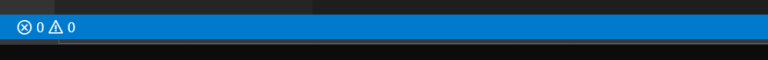
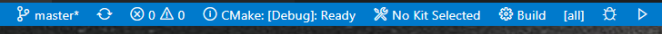

## Tại sao nên sử dụng CMake?

CMake là một hệ thống build mạnh mẽ và ổn định. Bạn chỉ định những gì bạn muốn thực hiện, chứ không phải cách thực hiện. CMake sau đó sẽ lấy thông tin đó và tạo ra các tệp cần thiết để build hệ thống. Ví dụ: CMake có thể tạo các tệp giải pháp (.sln) và tệp dự án (.vcxproj) mà Visual Studio và Visual Studio Code sử dụng trên Windows. Các khả năng tương tự cũng có sẵn cho mọi IDE phổ biến khác. Nó thậm chí có thể tạo các makefile nếu bạn muốn làm mọi thứ từ dòng lệnh. Vì nó có thể được gọi từ dòng lệnh, nên nó tích hợp tốt với các hệ thống tích hợp liên tục/xây dựng liên tục (CI/CD).

Bạn có thể chỉ định các công cụ build mà bạn muốn sử dụng; ví dụ: bạn có thể sử dụng MSVC hoặc LLVM trên Windows, và GNU hoặc LLVM trên các hệ thống giống Unix, bao gồm Linux, macOS và MSYS hoặc MinGW. Ngoài việc chỉ định các công cụ cần sử dụng, không yêu cầu thay đổi nào khác đối với các tệp đặc tả CMake. Bạn sẽ thấy điều này khi tôi chuyển (port) dự án của mình từ Windows bằng cách sử dụng các công cụ build Visual Studio sang Linux bằng cách sử dụng các công cụ build GNU.

Với CMake, bạn có thể tải xuống, build và sử dụng một số lượng lớn các công cụ. Tôi sẽ cho thấy một ví dụ về điều này khi tôi sử dụng Google Test trong dự án này. Hầu như bất kỳ công cụ nào có thể được tải xuống từ internet và cung cấp các tệp CMake để build đều có thể được sử dụng.

## Cài đặt các công cụ cần thiết

Tôi sẽ bắt đầu dự án trên Windows bằng VS Code và Visual Studio Build Tools, nhưng nếu muốn, bạn có thể bắt đầu với một IDE khác hoặc thậm chí một hệ điều hành khác. Trong một bài viết sau, tôi sẽ thảo luận về việc sử dụng các công cụ GNU trên Linux (Ubuntu).

Vậy hãy bắt đầu.

### Cài đặt Visual Studio Code và các tiện ích mở rộng

Trên Windows, phiên bản mới nhất của Visual Studio Code có sẵn trên [trang tải xuống](https://code.visualstudio.com/docs/?dv=win). Chọn phiên bản thích hợp; nhấp vào nút Windows cho phiên bản x64 hoặc một trong các liên kết ARM cho ARM nếu điều đó áp dụng cho bạn. Quá trình tải xuống sẽ bắt đầu. Khi hoàn tất, hãy chạy tệp đã tải xuống.

Tiếp theo, chúng ta cần hai tiện ích mở rộng VS Code. Khởi động VS Code và hiển thị bảng tiện ích mở rộng (chọn View → Extensions từ menu chính). Trong hộp tìm kiếm, nhập `C++`. Một số tiện ích mở rộng C và C++ sẽ được hiển thị. Bạn muốn tiện ích mở rộng có tên là C++. Hãy chắc chắn rằng nó đến từ Microsoft. Tiện ích mở rộng này cung cấp các khả năng IntelliSense, gỡ lỗi và duyệt. Nhấp vào nút Install để cài đặt nó.

Tiện ích mở rộng thứ hai là CMake Tools. Tìm kiếm và cài đặt nó.

### Cài đặt Visual Studio Build Tools

Chúng ta cần các công cụ build do Visual Studio cung cấp. Đừng lo lắng, chúng ta không cài đặt Visual Studio, chỉ cài đặt các công cụ build.

Trên [trang tải xuống của Visual Studio](https://visualstudio.microsoft.com/downloads/), di chuyển xuống phần All Downloads. Tại thời điểm tôi viết bài này, phiên bản hiện tại của Visual Studio là 2019, vì vậy tôi sẽ đề cập đến nó trong phần này. Nếu có sẵn phiên bản mới hơn, hãy sử dụng phiên bản đó. Chọn Tools for Visual Studio 2019. Nhấp vào nút Download cho Build Tools for Visual Studio 2019. Tải xuống và lưu tệp. Khi quá trình tải xuống hoàn tất, hãy mở tệp. Thao tác này sẽ khởi động Visual Studio Installer. Một lần nữa, đừng lo lắng, chúng ta không cài đặt Visual Studio, chỉ cài đặt các công cụ build. Khi cửa sổ trình cài đặt mở ra, chỉ chọn các công cụ build. Sau một thời gian (vài phút), quá trình cài đặt sẽ hoàn tất. Đóng trình cài đặt.

Mở menu Start của Windows và khởi động Developer Command Prompt for VS 2019; không mở Command Prompt hoặc PowerShell tiêu chuẩn. Tại Command Prompt, nhập:

```
cmake --version
```

Nội dung sau đây sẽ được hiển thị, mặc dù số phiên bản có thể khác:

```
cmake version 3.17.20032601-MSVC_2

CMake suite maintained and supported by Kitware (kitware.com/cmake).
```

Nếu thông báo cho biết rằng nó không thể tìm thấy CMake, thì các công cụ build đã không được cài đặt chính xác.

Bạn hầu như sẽ luôn khởi động VS Code từ dòng lệnh của Developer Command Prompt, vì vậy bạn có thể muốn thêm nó vào phần Productivity của menu Start.

### Cài đặt Git

Chúng ta sẽ cần Git. Nếu bạn đã thực hiện bất kỳ công việc phát triển nào, có thể bạn đã cài đặt nó. Nếu không, Git for Windows có sẵn [tại đây](https://git-scm.com/download/win).

## Một chương trình C++ đơn giản với thư viện

Chúng ta sẽ bắt đầu bằng cách tạo một chương trình C++ đơn giản với một thư viện đơn giản. Bạn có thể thực hiện các bước tương tự, với một số sửa đổi nhỏ, nếu bạn đang sử dụng Linux hoặc bất kỳ hệ thống nào giống Unix khác. Để hỗ trợ chương trình, chúng ta sẽ tạo cấu trúc thư mục và khởi động VS Code như sau:

Mở Developer Command Prompt. Nhập:

```
cd c:\Users\xxx   #where xxx is your Windows user name
mkdir Projects    # if you have not previously created a projects directory
cd Projects
mkdir vscode-cmake-hello
cd vscode-cmake-hello
mkdir apps
mkdir hello
cd hello
mkdir include
mkdir src
cd ..         # return to c:\Users\xxx\Projects\hello
git init      # initialize git for the project
code .        # start VS Code
```

Trong danh sách Explorer trong VS Code, chọn thư mục hello/include và tạo một tệp mới có tên hello.h. Đặt mã sau vào tệp đó và lưu nó:

```cpp
#pragma once

#include <string>

const std::string generateHelloString(const std::string & personName);
```

Một lần nữa trong danh sách Explorer, chọn hello/src và tạo một tệp mới có tên hello.cpp. Đặt mã sau vào tệp đó và lưu nó:

```cpp
#include "hello.h"

using namespace std;

const string generateHelloString(const string & personName)
{
    return "Hello " + personName;
}
```

Đó là tất cả mã chúng ta cần cho thư viện của mình. Bây giờ hãy tạo chương trình để sử dụng thư viện. Trong danh sách Explorer, chọn thư mục apps và tạo một tệp mới có tên main.cpp. Đặt mã sau vào tệp đó và lưu nó:

```cpp
#include <iostream>
#include "hello.h"

int main(int, char**) {
    std::string helloJim = generateHelloString("Jim");
    std::cout << helloJim << std::endl;

    return 0;
}
```

Để build thư viện và chương trình, chúng ta sẽ sử dụng CMake. Có rất nhiều ví dụ về CMake trên internet, nhiều ví dụ trong số đó đã lỗi thời hoặc đơn giản là không tốt. Đối với chương trình và thư viện này, tôi đang làm theo [Modern CMake](https://cliutils.gitlab.io/modern-cmake/) của Henry Schreiner và những người khác.

Trong danh sách Explorer, chọn VSCODE-CMAKE-HELLO trong VS Code và tạo một tệp mới. Đặt tên cho nó là CMakeLists.txt. Nhập nội dung sau và lưu tệp:

```cmake
# Yêu cầu CMake phiên bản 3.11 trở lên để cài đặt GoogleTest sau này
# vì vậy hãy yêu cầu nó ngay bây giờ.
cmake_minimum_required(VERSION 3.11-3.18)

project(
    VscodeCmakeHello
    VERSION 0.1
    DESCRIPTION "Ví dụ CMake nhỏ được build bằng VS Code")

add_subdirectory(hello)   # Tìm CMakeLists.txt trong thư mục con hello để xử lý
add_subdirectory(apps)    # Tìm CMakeLists.txt trong thư mục con apps để xử lý
```

Trong danh sách Explorer, chọn apps và tạo một tệp mới. Đặt tên cho nó là CMakeLists.txt. Nhập nội dung sau và lưu tệp:

```cmake
# Yêu cầu CMake phiên bản 3.11 trở lên để cài đặt GoogleTest sau này
# vì vậy hãy yêu cầu nó ngay bây giờ.
cmake_minimum_required(VERSION 3.11-3.18)

project(main)

add_executable(main main.cpp)
# Chúng ta cần hello.h và thư viện hello
target_link_libraries(main
    PRIVATE hello)

# Yêu cầu trình biên dịch C++ sử dụng các tính năng C++20. 
# Chúng ta không thực sự sử dụng bất kỳ tính năng nào trong số chúng.
target_compile_features(main PUBLIC cxx_std_20)
```

Tạo một tệp có tên CMakeLists.txt trong thư mục hello và đặt mã sau vào đó:

```cmake
# Yêu cầu CMake phiên bản 3.11 trở lên để cài đặt GoogleTest sau này
# vì vậy hãy yêu cầu nó ngay bây giờ.
cmake_minimum_required(VERSION 3.11-3.18)

project(hello)

add_library(hello src/hello.cpp)

# PUBLIC cần thiết để làm cho cả hello.h và thư viện hello 
# khả dụng ở nơi khác trong dự án
target_include_directories(${PROJECT_NAME}
    PUBLIC ${PROJECT_SOURCE_DIR}/include)

# Yêu cầu trình biên dịch sử dụng các tính năng C++20. 
# Mã không thực sự sử dụng bất kỳ tính năng nào trong số chúng.
target_compile_features(hello PUBLIC cxx_std_20)
```

## Sử dụng CMake với Visual Studio Code

Nhìn vào thanh trạng thái trên cửa sổ VS Code. Nếu nó trông giống như thế này:



thì hãy thoát và khởi động lại VS Code. Thanh trạng thái bây giờ sẽ trông như thế này:



Từ trái sang phải, `master*` cho biết rằng bạn đang chỉnh sửa nhánh git master và các thay đổi đã được thực hiện. Các ký hiệu và số 0 cho biết rằng hiện không có lỗi nào trong không gian làm việc. Tiếp theo là một nút sẽ chạy CMake (`CMake: [Debug]`). `No Kit Selected` cho biết rằng các công cụ build vẫn chưa được chọn; chúng ta sẽ đến với chúng trong giây lát. Tiếp theo là nút `Build`, mục tiêu mặc định, nút debug sẽ chạy ứng dụng ở chế độ gỡ lỗi và nút sẽ chạy ứng dụng mà không cần khởi động trình gỡ lỗi. Phần còn lại của thanh trạng thái cung cấp các thông tin khác mà chúng ta hiện không quan tâm.

Trước tiên, chúng ta phải chạy CMake để tạo các tệp build. Nhấp vào nút `CMake: [Debug]`. Lần đầu tiên bạn làm như vậy, một danh sách các bộ công cụ build sẽ được hiển thị bên dưới menu chính. Chọn `Unspecified` hoặc `Visual Studio Build Tools 2019 Release - amd64`. Văn bản `No Kit Selected` trong thanh trạng thái sẽ thay đổi thành `[Visual Studio Build Tools 2019 Release - amd64]` và một danh sách các cấu hình CMake được hiển thị: `Debug`, `Release`, `MinSizeRel` và `RelWithDebInfo`.

Chọn `Debug`. Thao tác này sẽ thực thi CMake và tạo tệp giải pháp Visual Studio (`.sln`) và các tệp dự án Visual Studio (`.vcxproj`) nếu không có lỗi. Nếu có lỗi, thì có gì đó không ổn với các tệp CMakeLists.txt hoặc các tệp nguồn C++.

Nếu bạn đã chọn bất kỳ hành động CMake nào khác, tệp thực thi, thư viện và các tệp liên quan đến gỡ lỗi sẽ được đặt trong các thư mục con khác. Ví dụ: nếu bạn build các phiên bản release, chúng sẽ được đặt trong `build/Release`.

Lần đầu tiên bạn chạy gỡ lỗi bằng cách nhấp vào nút `Debug` hoặc bằng cách chọn `Run → Start Debugging`, một danh sách các môi trường build sẽ được hiển thị ngay bên dưới menu chính. Chọn `C++ (Windows)`.

Để thực hiện làm sạch và build lại, tất cả những gì chúng ta phải làm là xóa thư mục build và tất cả nội dung của nó, sau đó chạy `CMake` và `Build`.

## Gỡ lỗi

Sau khi build debug, bạn có thể gỡ lỗi main.exe bằng cách nhấp vào nút debug trong thanh trạng thái. Ngoài ra, bạn có thể chọn `Run → Start Debugging` từ menu chính. Trong trường hợp thứ hai, lần đầu tiên bạn làm điều này, một danh sách các môi trường gỡ lỗi sẽ được hiển thị. Chọn `C++ (Windows)`. Nếu tệp đang hoạt động trong VS Code là tệp nguồn C++, thì danh sách cấu hình sẽ được hiển thị. Bạn có thể chọn `cl.exe - Build and debug active file` hoặc `Default configuration`. Nếu một loại tệp khác đang hoạt động, chẳng hạn như CMakeLists.txt, thì danh sách cấu hình sẽ không được hiển thị.

Trong cả hai trường hợp, một tệp có tên launch.json sẽ được thêm vào thư mục .vscode. Mở tệp đó và thay đổi chương trình thành `${workspaceFolder}/build/apps/Debug/main.exe`

Bây giờ bạn có thể chạy gỡ lỗi từ nút debug hoặc mục menu.

## Tóm tắt và Tiếp theo là gì

Bài viết này đã thảo luận về cách tạo một dự án C++ chứa một chương trình có tên main và một thư viện có tên hello với Visual Studio Code bằng cách sử dụng CMake. Cách gỡ lỗi chương trình cũng được thảo luận.

Vẫn còn nhiều việc phải làm, nhưng điều đó sẽ được thảo luận trong các bài viết sau:

- [Tạo Thư viện dùng chung](https://computingonplains.wordpress.com/building-c-applications-with-visual-studio-code-creating-a-shared-library/)
- [Thêm GoogleTest vào dự án](https://computingonplains.wordpress.com/building-c-applications-with-visual-studio-code-unit-testing-with-googletest/).
- [Lưu Dự án vào Hệ thống kiểm soát phiên bản](https://computingonplains.wordpress.com/building-c-applications-with-visual-studio-code-saving-the-project-to-source-control-using-git/)
- [Chuyển Dự án sang Linux](https://computingonplains.wordpress.com/building-c-applications-with-visual-studio-code-porting-to-linux/)